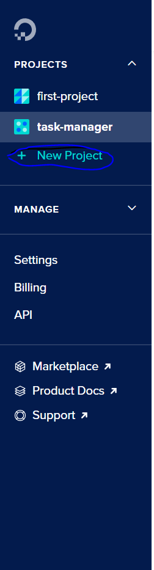
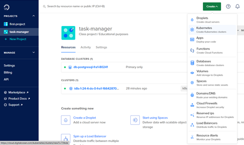

Application in progress.

In work: Project-service, Authentication-service 

Technology stack:
- Spring Boot (Data jpa, WEB)
- Hibernate (Core, Validator)/ JOOQ
- Kafka
- Swagger
- SQL/Postgresql
- Flyway
- K8s/Docker/Docker-compose/Helm

Instruction how to deploy authentication service on digital ocean platform

1) Go to digital ocean platform https://cloud.digitalocean.com/ and sign up.
2) Create project.

  

3) Create k8s cluster

4) Push docker image to docker hub
 - docker tag "Image id" "dockerHub id"/"repository name":"tag name".
 - docker login - u "docker hub id" -p "docker hub password".
 - docker push "dockerHub id"/"repository name":"tag name"

6) Apply deployment and service.
  - kubectl apply -f deployment.yaml
  - kubectl apply -f service.yaml

7) If you want you can add dns to your cluster and add database instance.

In Future:
- Add Monitoring system(Prometheus/Grafana)
- Deploy application in AWS EKC.
